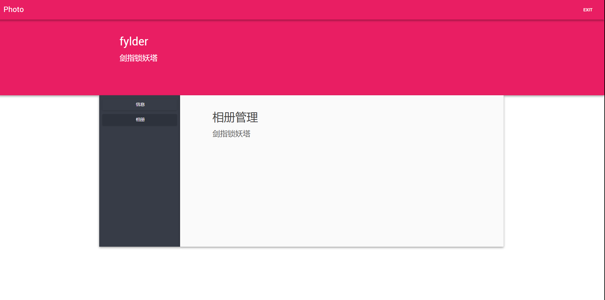

# [Material-UI](https://github.com/callemall/material-ui) - Example Webpack Project

This is an example project that uses [Material-UI](https://github.com/callemall/material-ui).

## Installation

After cloning the repository, install dependencies:
```sh
cd <project folder>/material-ui/examples/webpack-example
npm install
```

Now you can run your local server:
```sh
npm start
```
Server is located at http://localhost:3000

Note: To allow external viewing of the demo, change the following value in `webpack-dev-server.config.js`

```
host: 'localhost'  //Change to '0.0.0.0' for external facing server
```

## Description of [Webpack](http://webpack.github.io/docs/)

Webpack is a module bundler that we are using to run our documentation site.
This is a quick overview of how the configuration file works.

### Webpack Configuration:

#### Entry

Webpack creates entry points for the application to know where it starts.

#### Output

This is where the bundled project will go to and any other files necessary for it to run.

#### Plugins

These are plugins Webpack uses for more functionality.
The HTML Webpack Plugin, for example, will add the index.html to your build folder.

#### Modules

Modules and other things that are required will usually need to be loaded and interpreted by Webpack when bundling, and this is where Webpack looks for the different loaders.
*Loading .js files in es6 and es7 will require a loader like babel-loader to interpret the files into es5.

##### demo


